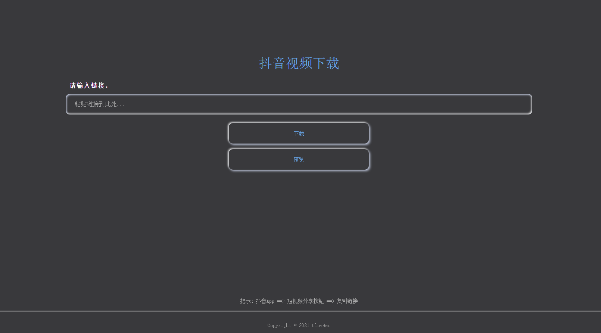
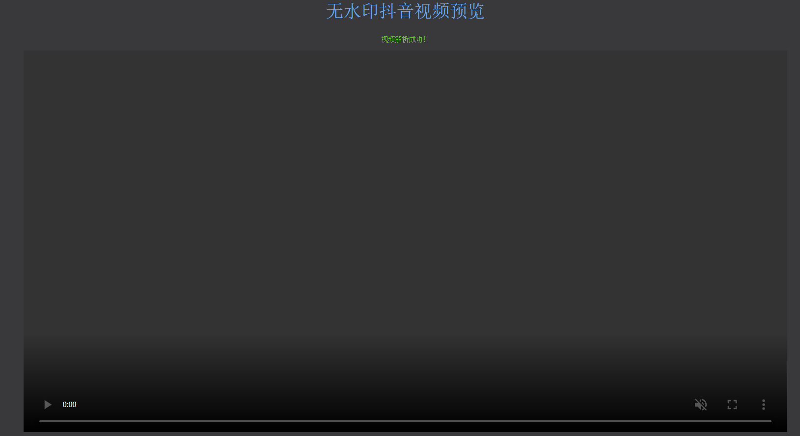

# 1 抖音视频下载
基于 python 3.7 + django 2.2.3, 实现解析抖音视频的分享链接，获取原始视频，支持在线观看和下载。
# 2 安装
```bash
# 安装相关库
pip install -r requirements.txt

# 运行
python manage.py runserver

# 运行指定端口
python manage.py runserver 127.0.0.1：8088
```
# 3 预览



